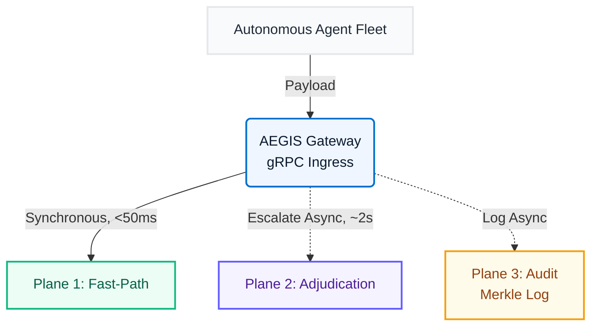
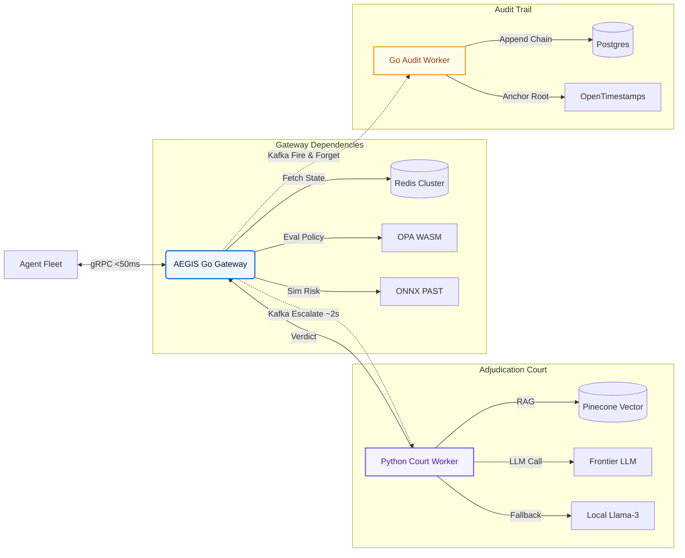
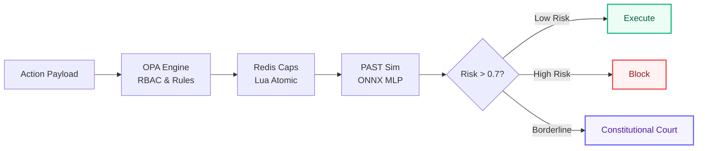
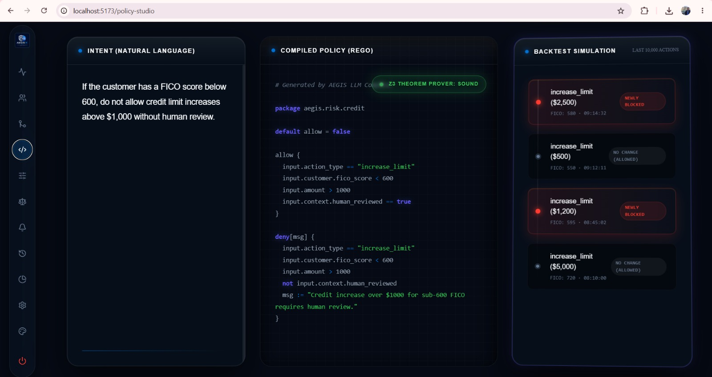
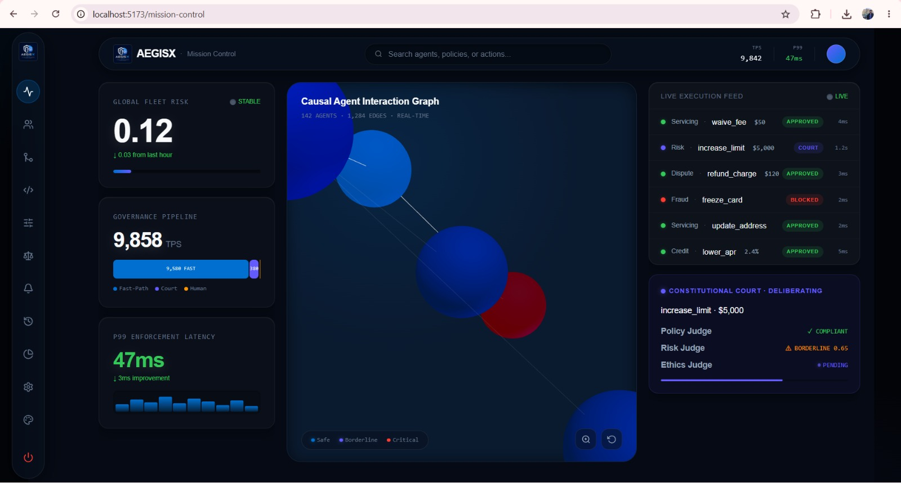
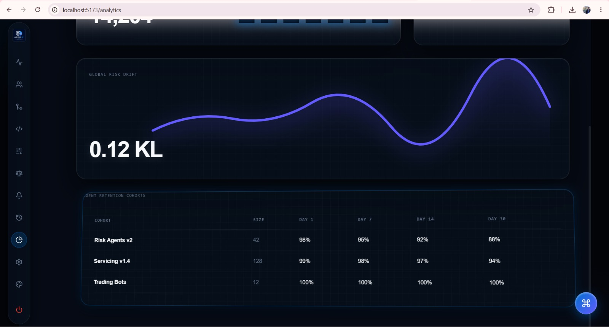
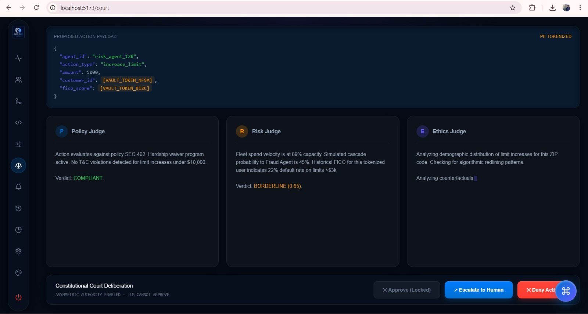

# AEGIS
**Agentic Enforcement, Governance & Intervention System**

> The Trust Layer for Autonomous Financial Agents. A causal governance plane that intercepts, simulates, and adjudicates autonomous agent actions before execution—eliminating emergent fleet risk in real-time.

---

## The Hidden Problem
The failure mode isn't a rogue agent. It's three correct agents: Agent A waives a fee, Agent B cuts the limit, Agent C restricts the card. Nothing in the system evaluates this span. Static rule engines cannot model cascading fleet interactions.

## Unique Insight & Impact
Governance must evaluate the resulting state, not the requested action. An action is not risky. A state is risky. AEGIS replaces manual monitoring with real-time, predictive enforcement (<50ms) to eliminate algorithmic redlining and instant account lockouts, preserving trust.

---

## 🏛️ Unified 3-Plane Architecture

## 🏗️ System Component Topology

## ⚡ Deterministic Fast-Path Pipeline

---

## 🚀 System Capabilities & Feature Overview

### 1. Core Governance & Fast-Path Enforcement
- **State-Based Composite Invariant Evaluation:** Evaluating the resulting state ($S_{t+1}$) rather than just the requested action to prevent emergent cascade failures.
- **Deterministic Fast-Path Pipeline:** Sub-50ms synchronous enforcement handling 95% of agent traffic.
- **In-Process OPA Policy Evaluation:** Open Policy Agent compiled to WebAssembly running locally in the Go Gateway to eliminate network latency for static rule checks.
- **Atomic Probabilistic Spend Caps:** Redis Lua scripts executing DECRBYFLOAT atomically to prevent race conditions in dynamic spend limits.
- **Asynchronous Pause/Resume:** Halting agent execution via Kafka acknowledgment waits during slow-path escalations and resuming asynchronously upon verdict.

### 2. AI Adjudication & LLM Court
- **Constitutional Agent Court (CAC):** Multi-agent LLM deliberation for borderline actions using Policy, Risk, and Ethics personas.
- **Asymmetric LLM Authority:** Strict architectural constraint ensuring the LLM can only Deny or Escalate to humans; it can never Approve an action.
- **GraphRAG Context Retrieval:** Combining Pinecone vector search and Neo4j graph traversal to provide the LLM with relational policy context.
- **NeMo Guardrails Integration:** Stripping PII, enforcing strict JSON output schemas, and preventing prompt injection attacks before LLM processing.
- **Fallback Circuit Breaker:** Tripping after consecutive LLM API failures to route traffic to a local Llama-3 8B model or default to DENY for high-risk actions.

### 3. Predictive Intelligence & Causal Modeling
- **Pre-Action Shadow Simulation (PAST):** An ONNX-compiled 4-layer MLP that applies proposed actions to a digital twin of the fleet to predict local cascade risk in <20ms.
- **Causal Agent Interaction Graph (CAIG):** A GraphSAGE GNN running offline to learn causal influence coefficients (edge weights) between agents.
- **GNN-to-ONNX Distillation:** Exporting learned causal graph weights into the deterministic PAST ONNX model to keep the fast-path synchronous while benefiting from graph dynamics.
- **Behavioral Drift Detection:** LSTM Autoencoders computing agent behavioral fingerprints (action distributions, latencies) and measuring KL divergence to detect anomalies.
- **Risk-Adaptive Spend Limits:** Reinforcement Learning (Contextual Bandits via Thompson Sampling) dynamically tightening or loosening spend caps based on real-time fleet risk.

### 4. Cryptographic Audit & Replay
- **Merkle Tree Append-Only Audit Log:** Cryptographic hashing (`SHA-256(prev_hash + payload)`) of every action, state transition, and reasoning chain in Postgres.
- **OpenTimestamps Blockchain Anchoring:** Periodically anchoring the Merkle root to the Bitcoin blockchain via AWS Lambda for regulatory immutability without private blockchain overhead.
- **Time-Travel Replay Engine:** Reconstructing fleet state at any historical millisecond using Kafka log compaction (24h retention) and Postgres audit trails.
- **Differential Privacy Audit Queries:** Allowing regulators/internal auditors to query aggregate insights from PII-containing audit logs with formal mathematical privacy guarantees.

### 5. Policy Management & Self-Healing
- **LLM-Synthesized Policy Compiler:** Translating natural language operator inputs into formal OPA/Cedar Rego policies, checking for conflicts, and deploying in real-time.
- **Self-Healing Policy Auto-Remediation:** Automatically generating candidate OPA policies when violations occur, validating them via historical simulation, and proposing them to operators.
- **Policy Simulation Validation:** Running newly compiled policies against historical actions to show operators exactly what would have been blocked or allowed.

### 6. Security & Fault Tolerance
- **Hierarchical Cascading Kill Switch:** Modeling safe shutdown sequences via topological sort of agent dependencies; leaf agents die instantly, root agents finish in-flight transactions.
- **Zero Trust Network Topology:** Strict network segregation across DMZ (ALB/WAF), Private (EKS), and Isolated Data (RDS/Redis) subnets.
- **SPIFFE/SPIRE mTLS Authentication:** Short-lived X.509 certificates for all agent-to-gateway and microservice-to-microservice communication.
- **AWS Nitro Enclaves:** Running LLM Court processing in isolated hardware enclaves so even system administrators cannot view the context payloads.
- **Fail-Closed Architecture:** Defaulting to DENY for high-risk actions if state stores (Redis) time out or LLM infrastructure fails.

### 7. Operator UI & Mission Control
- **Real-Time Fleet Visualization:** React + D3.js force-directed graph showing agents as nodes, edge thickness representing causal influence, and node color representing real-time risk.
- **Live Action WebSocket Feed:** Streaming every proposed, approved, and blocked action to the operator dashboard with <100ms latency.
- **Constitutional Court View:** Streaming live LLM debate transcripts, verdict displays, and dissenting opinions.
- **Policy Studio UI:** Interface for typing natural language policies, viewing compiled Rego code, and seeing simulation results before deployment.
- **Audit Time Machine UI:** Timeline scrubber to reconstruct complete fleet state at any past moment, complete with cryptographic verification badges.
- **Natural Language Audit Query:** Allowing operators to ask questions like "Show me all fee waivers > $100 for FICO < 600" translated via LLM-to-SQL.

### 8. Infrastructure & DevOps
- **AWS EKS Deployment:** Containerized Go and Python workers orchestrated via Kubernetes.
- **KEDA Autoscaling:** Scaling Python Court Workers based on Kafka lag metric rather than just CPU utilization.
- **GitOps CI/CD Pipeline:** GitHub PR → Run Tests → Build Docker → Trivy Scan → ArgoCD Sync.
- **Blue/Green Deployment Strategy:** Shifting gateway traffic 5% → 25% → 100% with automated rollback if P99 latency exceeds 50ms.
- **OpenTelemetry End-to-End Tracing:** Injecting Trace IDs at the Gateway and passing them through OPA → PAST → Court for full observability.

### 9. Future / Advanced Extensions (Version 100 & Research)
- **Recursive Meta-Governance:** AEGIS monitoring itself (governance of the governance plane) to create a provably self-consistent fixed point.
- **Cross-Fleet Federation:** Banks sharing governance threat intelligence like a CERT for AI agents.
- **Regulator Portal:** CFPB/Fed direct query access to audit trails with DP guarantees.
- **Agent-to-Agent Negotiation Protocol:** Agents negotiating resource allocation under AEGIS supervision.
- **Causal Counterfactual Audit:** Querying "Had Agent A not acted, what would have happened?" using do-calculus.
- **Adversarial Red Team Agent:** An autonomous agent constantly probing AEGIS for governance gaps.
- **Formal Verification:** Mathematically proving certain policies can never be violated (via Z3 Theorem Prover).
- **Vision AI (VLM) Auditing:** Using Vision-Language Models to audit agent UI interactions if an agent operates via a screen.
- **Speech AI Emergency Stop:** Voice-activated hierarchical kill switch ("AEGIS, halt all agents").

---

## 📸 Interface Gallery

Here are a few glimpses into the AEGIS operational dashboards:

### Live Fleet Visualization & Risk Metrics
*A force-directed representation of agent interactions, highlighting causal pathways and cascading risk metrics.*

### Constitutional Court Adjudication
*The multi-agent LLM debate dashboard, displaying the real-time reasoning of the Policy, Risk, and Ethics personas.*

### Pre-Action Shadow Simulation (PAST)
*Digital twin modeling environment where proposed agent actions are probabilistically simulated for emergent threats.*

### Hierarchical Global Kill Switch
*The emergency mission control view, capable of halting specific agent classes or executing a complete topological shutdown.*

